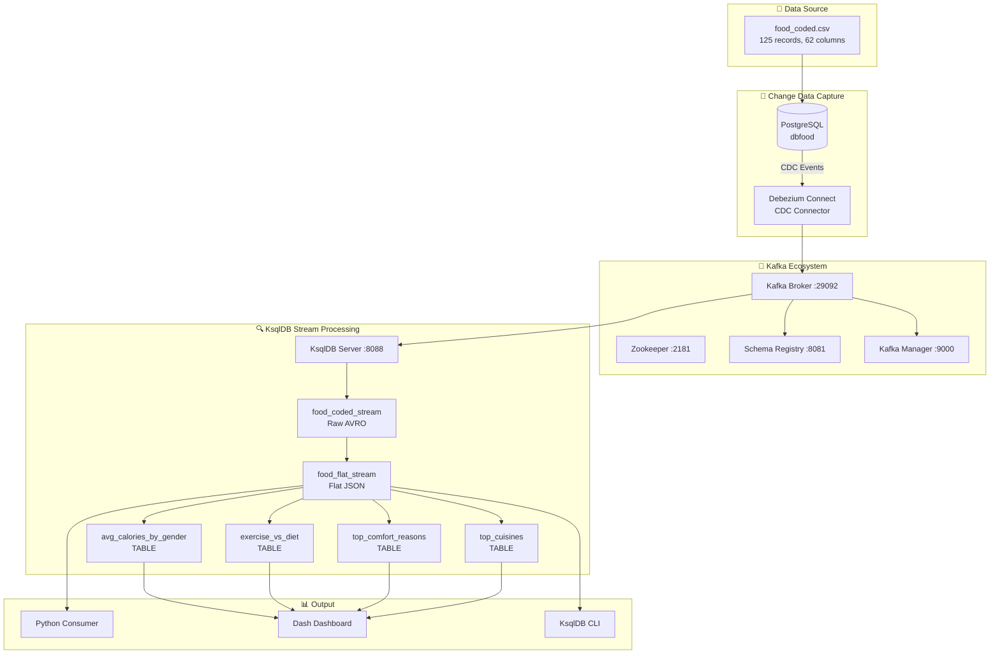
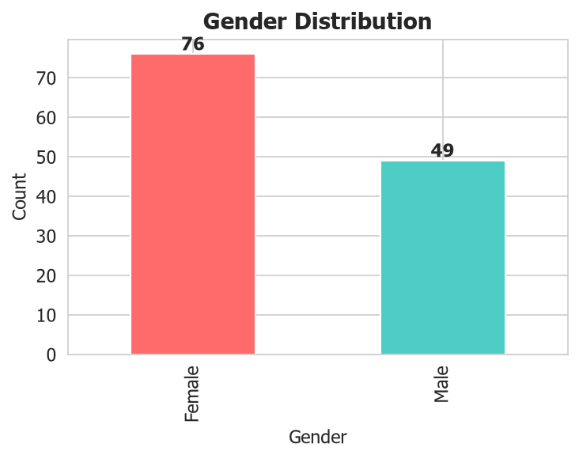
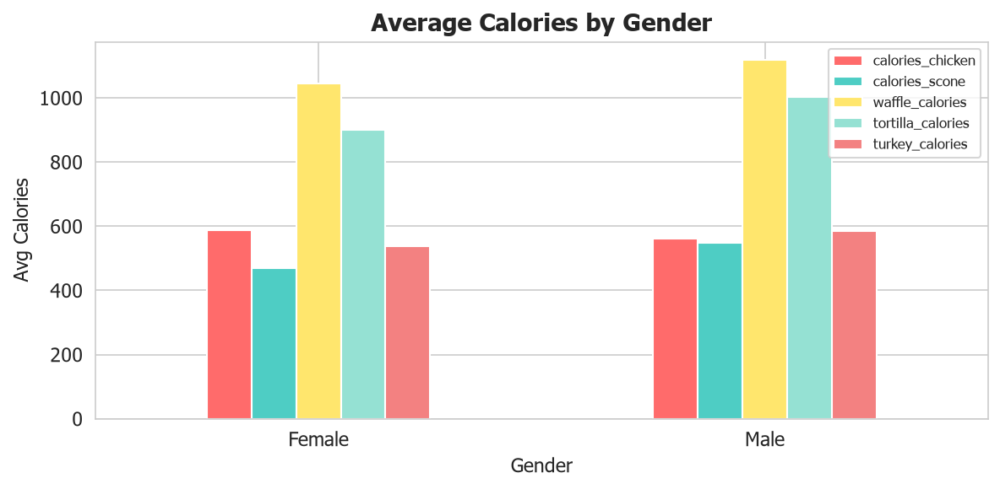
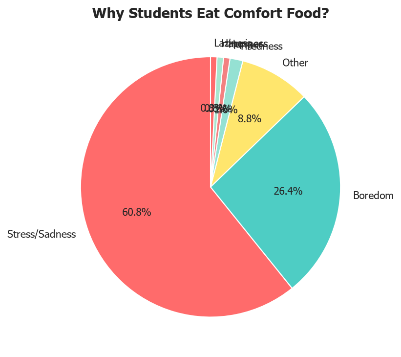
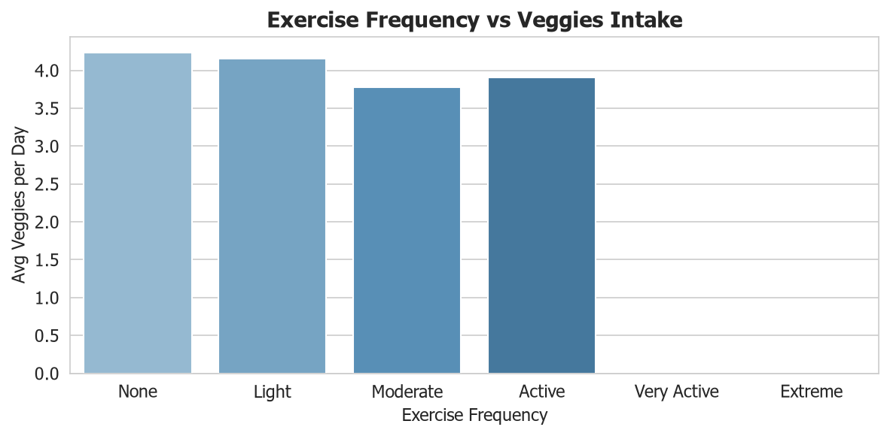
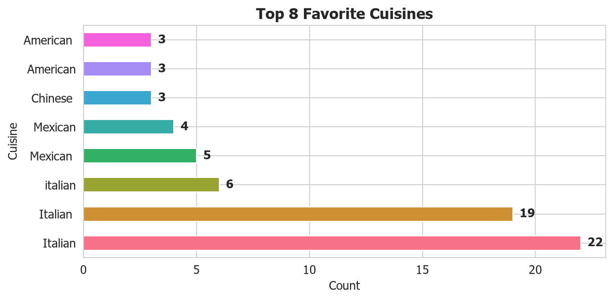
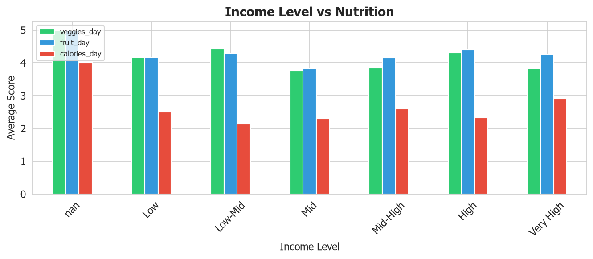

# DADS6005 Data Streaming with Kafka + KsqlDB

โปรเจกต์ Data Streaming สำหรับรายวิชา DADS6005 (Quiz 2)
ใช้ **Apache Kafka**, **Debezium CDC**, และ **KsqlDB**
เพื่อทำ Real-time Stream Processing กับชุดข้อมูล Food Survey (food_coded.csv)

---

## Architecture



---

## Dataset Preview




ชุดข้อมูล **food_coded.csv** ประกอบด้วยคำตอบจากแบบสอบถามนักศึกษา 125 คน มีทั้งหมด 62 คอลัมน์
ครอบคลุมพฤติกรรมการกิน อาหารที่ชอบ วิถีชีวิต และข้อมูลประชากร

---

## Services (Docker)

| Service | Port | Description |
|---------|------|-------------|
| Zookeeper | 2181 | Coordination |
| Kafka | 29092 | Message broker |
| Schema Registry | 8081 | Schema management |
| Debezium Connect | 8083 | CDC connector |
| Kafka Manager | 9000 | Kafka UI |
| **KsqlDB Server** | **8088** | **Stream processing engine** |
| **KsqlDB CLI** | - | **Interactive SQL CLI** |

---

## Quick Start

### 1. Start Docker services
```bash
docker-compose up -d
```

### 2. Configure Debezium connector (via REST API)
```bash
curl -X POST http://localhost:8083/connectors -H "Content-Type: application/json" -d '{
  "name": "food-connector",
  "config": {
    "connector.class": "io.debezium.connector.postgresql.PostgresConnector",
    "database.hostname": "postgres",
    "database.port": "5432",
    "database.user": "postgres",
    "database.password": "123456",
    "database.dbname": "dbfood",
    "database.server.name": "source",
    "table.include.list": "public.db_food_coded2_stream",
    "plugin.name": "pgoutput"
  }
}'
```

### 3. Run KsqlDB setup
```bash
# Interactive CLI
docker exec -it ksqldb-cli ksql http://ksqldb-server:8088

# Or run script files via REST
python pipeline.py ksql --script ksqldb/01_create_streams.ksql
python pipeline.py ksql --script ksqldb/02_create_tables.ksql
```

### 4. Stream data to Kafka
```bash
python pipeline.py stream --csv food_coded.csv --topic food_coded_json --interval 1
```

### 5. Run analytics queries
```bash
python pipeline.py ksql --script ksqldb/03_analytics_queries.ksql
```

### 6. List Kafka topics
```bash
python pipeline.py list-topics
```

---

## KsqlDB Scripts

| File | Description |
|------|-------------|
| `ksqldb/01_create_streams.ksql` | สร้าง STREAM จาก Debezium CDC topic |
| `ksqldb/02_create_tables.ksql` | สร้าง Materialized Tables สำหรับ aggregation |
| `ksqldb/03_analytics_queries.ksql` | Push & Pull queries สำหรับวิเคราะห์ข้อมูล |

---

## Interesting Insights from Data

### 🥧 Why do students eat comfort food?



สาเหตุหลักที่นักศึกษากิน comfort food คือ **Stress/Sadness (41.4%)** และ **Boredom (30.7%)**
— สะท้อนถึงความเครียดจากการเรียนและความเบื่อหน่ายในชีวิตประจำวัน

---

### 🏋️ Exercise vs Veggies Intake



คนที่ออกกำลังกายมากมักกินผักมากกว่า — นักศึกษาที่ออกกำลังกาย **Extreme** กินผักเฉลี่ย 5.0 มื้อ/วัน
เทียบกับคนที่ **ไม่ออกกำลังกาย** กินเพียง 2.8 มื้อ/วัน

---

### 🌍 Top 8 Favorite Cuisines



**Italian cuisine** ครองแชมป์อาหารสุดโปรดของนักศึกษา ตามด้วย American และ Mexican

---

### 💰 Income vs Nutrition



กลุ่มรายได้สูงมีแนวโน้มกินผักและผลไม้มากกว่า — แต่ calories_day ไม่ได้ต่างกันมาก
ชี้ให้เห็นว่าคนรายได้น้อยกว่ากินอาหารที่ calorie dense แต่คุณภาพโภชนาการต่ำกว่า

---

## Files

| File | Description |
|------|-------------|
| `docker-compose.yml` | Docker services configuration |
| `food_coded.csv` | Food survey dataset (125 records) |
| `pipeline.py` | Python CLI for streaming + KsqlDB |
| `Kafka Producer.ipynb` | Basic producer notebook |
| `Kafka Consumer.ipynb` | Basic consumer notebook |
| `Insert_records_connect.ipynb` | CDC insert into PostgreSQL |
| `List topics and read sales Data Stream.ipynb` | Topic listing + Debezium consumer |
| `KsqlDB_Demo.ipynb` | Full pipeline demo notebook |
| `ksqldb/` | KsqlDB SQL scripts |
| `assets/` | Generated charts & diagrams |
| `requirements.txt` | Python dependencies |
| `generate_charts.py` | Script to regenerate charts |
