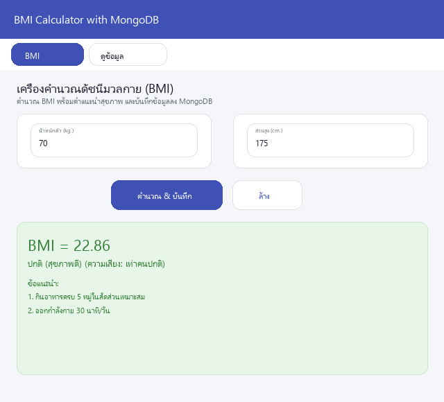
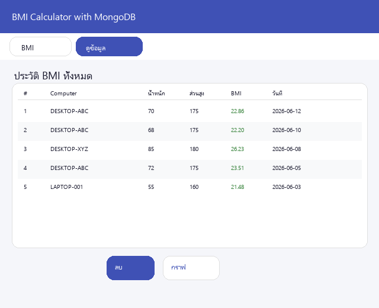
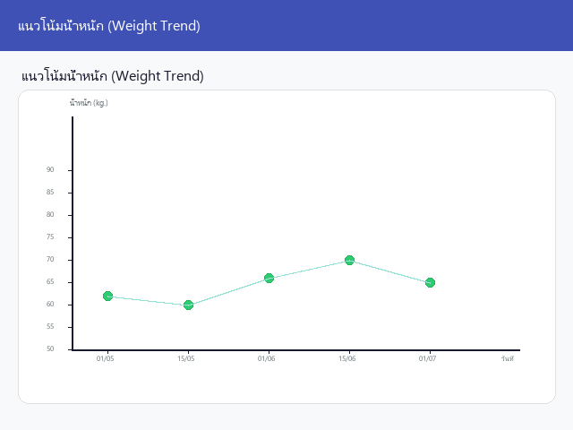

# BMI Calculator with MongoDB

**DADS6005 Data Streaming — Quiz 1 (MongoDB)**

แอปพลิเคชันคำนวณค่าดัชนีมวลกาย (BMI) แบบ GUI ด้วย **Python Tkinter**
บันทึกข้อมูลลง **MongoDB** พร้อมฟังก์ชันเพิ่ม ลบ แก้ไข และดูกราฟแนวโน้มน้ำหนัก

---

## Features

| Feature | Description |
|---------|-------------|
| 🧮 **BMI Calculator** | คำนวณ BMI พร้อมแสดงสถานะสุขภาพและคำแนะนำ |
| 💾 **Save to MongoDB** | บันทึกประวัติ BMI ทุกครั้งที่คำนวณ |
| 📋 **View Data** | ดูประวัติทั้งหมดในรูปแบบตาราง |
| ✏️ **Update / Delete** | แก้ไขหรือลบ record |
| 📈 **Weight Trend Graph** | กราฟแสดงแนวโน้มน้ำหนักแบบ Scatter + Line |

---

## Screenshots

### BMI Calculator Tab



ป้อนน้ำหนักและส่วนสูง → คำนวณ BMI → แสดงสถานะสุขภาพพร้อมคำแนะนำ และบันทึกข้อมูลลง MongoDB โดยอัตโนมัติ

### View Data Tab



ดูประวัติ BMI ทั้งหมดในรูปแบบตาราง พร้อมปุ่ม Update, Delete และ Show Graph

### Weight Trend Graph



กราฟ Scatter + Line แสดงแนวโน้มน้ำหนักตามช่วงเวลา ช่วยติดตามการเปลี่ยนแปลงของน้ำหนัก

---

## Architecture

```
┌──────────────┐       ┌──────────────┐       ┌──────────────┐
│  User Input   │──────▶│  Python GUI  │──────▶│   MongoDB    │
│  (Tkinter)    │       │  (main.py)   │       │  (CRUD ops)  │
└──────────────┘       └──────────────┘       └──────────────┘
                              │
                              ▼
                      ┌──────────────┐
                      │  BMI Logic   │
                      │  + Category  │
                      └──────────────┘
```

## Quick Start

### 1. Prerequisites

- Python 3.8+
- MongoDB (local หรือ Docker)

```bash
# Start MongoDB with Docker
docker run -d --name mongodb -p 27017:27017 mongo:7
```

### 2. Install dependencies

```bash
pip install flet pymongo pandas matplotlib
```

### 3. Run the app

```bash
python main.py
```

> **Flet** จะเปิดหน้าต่าง GUI แบบ native (Flutter engine) หรือจะเปิดเป็น Web App ก็ได้:
> ```bash
> python -c "import flet; flet.app(target=main, view=ft.WEB_BROWSER)"
> ```

---

## File Structure

```
MongoDB/
├── main.py         # GUI application (Tkinter)
├── mongodb.py      # MongoDB CRUD wrapper class
└── README.md
```

### mongodb.py

```python
from mongodb import MongoDBManager

db = MongoDBManager()          # Connect to local MongoDB
db.ping()                      # Health check
db.insert_doc("PC1", 70, 175, 22.86)
db.find_all()                  # List all records
db.find_by_id("...")           # Find by _id
db.replace_one("...", ...)     # Update record
db.delete_by_id("...")         # Delete record
```

### BMI Classification (Thai standard)

| BMI Range | Category | Color |
|-----------|----------|-------|
| < 18.50 | น้ำหนักต่ำกว่าเกณฑ์ | 🔴 Red |
| 18.50 - 22.90 | ปกติ (สุขภาพดี) | 🟢 Green |
| 23.00 - 24.90 | ท้วม / โรคอ้วนระดับ 1 | 🟡 Yellow |
| 25.00 - 29.90 | อ้วน / โรคอ้วนระดับ 2 | 🟠 Orange |
| > 30 | อ้วนมาก / โรคอ้วนระดับ 3 | 🔴 Red |

---

## Tech Stack

| Component | Technology |
|-----------|-----------|
| GUI Framework | **Flet** (Flutter engine — Material 3 Design) |
| Database | **MongoDB** (via PyMongo) |
| Chart | **Matplotlib** (embedded in Flet) |
| Language | **Python 3.8+** |

## Improvements from Original

| Original | Improved |
|----------|----------|
| `insert_doc` calls `insert_one` twice (duplicate bug) | Insert ครั้งเดียว, return `inserted_id` |
| Global scope code runs on import | Class-based `MongoDBManager` |
| BMI logic duplicated in `find_bmi()` and `update_bmi()` | Single `calculate_bmi()` + `bmi_category()` function |
| `updatepage` opens new `Tk()` root window | Opens `Toplevel()` dialog |
| `clearToTextInput()` broken | `clear_inputs()` works correctly |
| Hardcoded list indices `tmp[5]`, `tmp[2]` in graph | Uses dict keys `_date`, `_weight` |
| No error handling | Try/except + `messagebox` warnings |
| Spaghetti ~276 lines | Clean modular ~240 lines |
| **GUI: Tkinter (Windows 95 style)** | **GUI: Flet (Material 3 — Flutter engine)** |
| **Emoji icons ไม่แสดง / Thai font ติดปัญหา** | **Material Icons + Flutter รองรับภาษาไทย native** |
| **Matplotlib ติดปัญหา font family** | **Flet แสดงผลกราฟผ่าน MatplotlibChart** |
